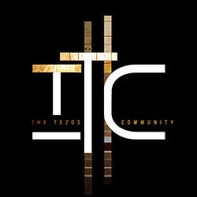

# Awesome Tezos 

> A curated list of Tezos Ecosystem dApps, tools, and communities.

---

## Support

This list is maintained by passionate Tezos enthusiasts and supported with special thanks by:
		 
		 
		<a href="https://thetezos.com">
			
             
            The Tezos Community
		</a>
		 
		 

> If you would like to pledge support and have your project featured here, please [submit an issue](https://github.com/TheTezosCommunity/awesome-tezos/issues/new/choose).

You too can support this list and <strong>The Tezos Community</strong> directly by sending donations to
 
<code>donate.awesome-tezos.tez</code>

	Just type <a href="https://awesome-tezos.tez.page/"><code>awesome-tezos.tez.page</code></a> to go here.

## Contents

-   [Wallets](#wallets)
-   [Defi](#defi)
-   [NFTs](#nfts)
    -   [Marketplaces](#nft-marketplaces)
    -   [Tools](#nft-tools)
-   [Games](#games)
-   [VR / Metaverse](#vr--metaverse)
-   [Organizations](#organizations)
    -   [Foundations](#foundations)
    -   [Communities](#communities)
    -   [Development Teams](#development-teams)
    -   [Distributed Autonomous Organizations (DAOs)](#daos)
-   [Media](#media)
    -   [News](#news)
    -   [Audio/Video](#audio--video)
-   [Communication](#communication)
-   [Block Explorers](#block-explorers)
-   [Documentation](#documentation)
-   [Baking Tools](#baking-tools)
-   [Development Tools](#development-tools)
-   [Contribute](#contribute)
-   [Contributors](#contributors)

## Wallets

> The first step of participating in the Tezos ecosystem is selecting your wallet provider.

-   [Kukai](https://wallet.kukai.app/)
-   [Temple](https://templewallet.com/)

([top](#contents))

## Defi

> Decentralized Finance

-   [Crunchy](https://crunchy.network/)
-   [Spicyswap](https://hd.spicyswap.xyz/)
-   [Plenty](https://plenty.network/)
-   [Quipuswap](https://quipuswap.com/)
-   [Matter](https://matterdefi.xyz/)

([top](#contents))

## NFTs

> Non-fungible Tokens

### NFT Marketplaces

> Buy, sell, create, raffle, & more

-   [Objkt](https://objkt.com/)
-   [fxhash](https://www.fxhash.xyz/)
-   [Teia.art](https://teia.art/)
-   [Teia.cafe](https://www.teia.cafe/)
-   [TzRaffles.fun](https://www.tzraffles.fun/)
-   [ArtDex](https://artdex.io/)
-   [Tezos Art Vending Machine](https://www.vendingnfts.xyz/)
-   [pepe-et-nunc](https://www.pepeetnunc.art/)
-   [tesserart](https://tesserart.xyz/)
-   [Emergent Properties](https://emprops.ai/)

([top](#contents))

### NFT Tools

> Utilities to help in creating, buying, and managing single NFTs or entire collections

-   [nftbiker.tez Tools](https://nftbiker.xyz/)
-   [PureSpider's fxhash PFP generator](https://github.com/PureSpider/fxhash-pfp)
-   [FA2 Bakery](https://fa2-bakery.netlify.app/)

([top](#contents))

## Games

> Ways to play with your XTZ

-   [Chainborn](https://chainborn.xyz/)
-   [Tezos Cartel HQ](https://tezoscartel.xyz/)

([top](#contents))

## VR / Metaverse

-   [oncyber](https://oncyber.io/)

([top](#contents))

## Organizations

### Foundations

-   [Tezos Foundation](https://tezos.foundation/)

([top](#contents))

### Communities

-   [The Tezos Community](https://thetezos.com/)
-   [Tezos Commons](https://tezoscommons.org/)
    > "Tezos Commons supports the ideas, individuals and organizations dedicated to building the digital commonwealth"
-   [Tezos Pepe](https://tezospepe.com/)

([top](#contents))

### Development Teams

-   [Nomadic Labs](https://www.nomadic-labs.com/)
    > Research and Development, core development, and adoption assistance for Benelux
-   [Trilitech](https://www.trili.tech/)
    > Development, core development, and adoption assistance
-   [Marigold](https://www.marigold.dev/)
    > Development team focused on testing and developing upgrades to the Tezos Protocol

([top](#contents))

### DAOs

> Decentralized Autonomous Organizations

#### DAO Tools

-   [Homebase](https://tezos-homebase.io/)
    > Create, join, and participate in DAO voting

([top](#contents))

## Media

### News

-   [XTZ News](https://xtz.news/en/)

([top](#contents))

### Audio / Video

-   [#BlockchainEvolved](https://www.youtube.com/@BlockchainEvolved)
    > The Blockchain Evolved show focuses on the Tezos protocol and the broader Tezos ecosystem!
-   [1M TPS demo and visualization](https://www.youtube.com/watch?v=2EgjMvEIGww&ab_channel=Tezos)
    > 10-minute workshop captured live from TEZDEV 2023, where Emma Turner and Thomas Letan demonstrate 1 million transactions per second (1M TPS) on Tezos.

([top](#contents))

## Communication

-   [Mailchain](https://app.mailchain.com/)
    > multichain secured emailing application

([top](#contents))

## Block Explorers

-   [tzkt](https://tzkt.io/)
-   [tzStats](https://tzstats.com/)
-   [BetterCallDev](https://better-call.dev/)
    > Blockchain interaction by UI
-   [Baking Bad](https://baking-bad.org/)
    > check your staking rewards and find the most complete list of Tezos delegation services.
-   [Bandog](https://bandog.tez.page/)
    > collect and analyze Tezos address data (history, circular connections, ObjKT bans, etc)

([top](#contents))

## Documentation

-   [Tezos Agora](https://forum.tezosagora.org/)
    > Forum to exchange about ideas and proposals related to Tezos
-   [Octez and Protocol Documentation](https://tezos.gitlab.io/introduction/tezos.html)
-   [Open Tezos](https://opentezos.com/)

([top](#contents))

## Baking Tools

> Tools to assist delegates ("bakers") manage their operations.

-   [Tez Capital](https://docs.tez.capital/)
-   [La Boulange](https://github.com/LaBoulange/tezos-baker/)

([top](#contents))

## Development Tools

-   [Sign In With Tezos](https://siwt.xyz/)
    > Node.js (NPM) Package to handle user auth via token ownership, balance, etc.
-   [Taquito](https://tezostaquito.io/)
    > Typescript library to abstract common blockchain interactions - develop Tezos blockchain apps faster and easier
-   [SmartPy](https://smartpy.io/)
    > A comprehensive solution for developing, testing, and deploying smart contracts on the Tezos blockchain. All in familiar Python syntax.
-   [Ligo](https://ligolang.org/)
    > A simple smart-contract language built for Tezos, made for developers.
-   [Alis.is Tea](https://github.com/alis-is/tea)
    > Self-contained smart contracts development environment

([top](#contents))

## Contribute

Contributions welcome! Read the [contribution guidelines](contributing.md) first.

([top](#contents))

## Contributors

**Special thanks to these Awesome contributors:**

-   [skullzarmy](https://github.com/skullzarmy)
-   [LaBoulange](https://github.com/LaBoulange)

([top](#contents))
