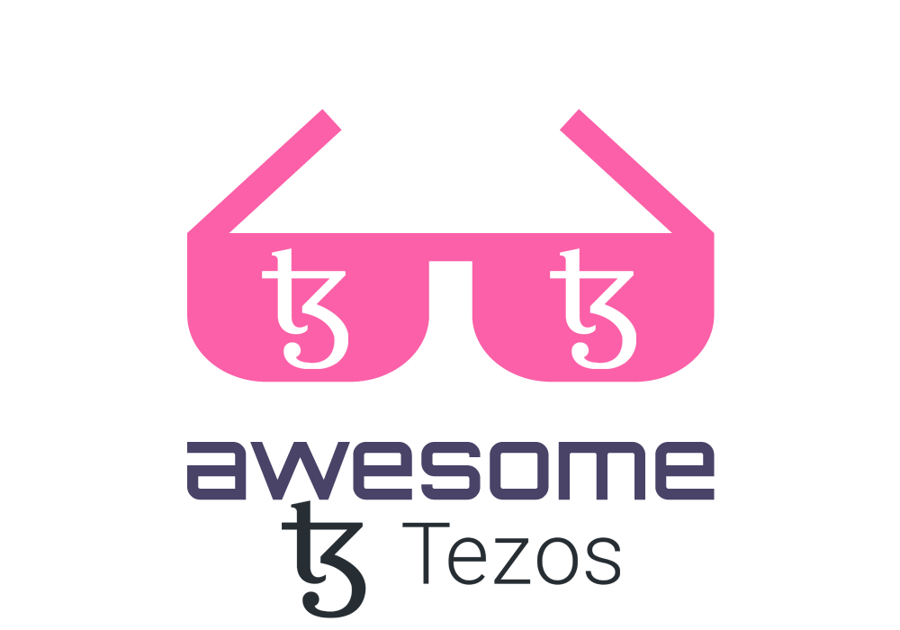

# Awesome Tezos 

> A curated list of Tezos Ecosystem dApps, tools, and communities.

## Contents

-   [Wallets](#wallets)
-   [Defi](#defi)
-   [Organizations](#organizations)
    -   [Foundations](#foundations)
    -   [Communities](#communities)
-   [News](#news)
-   [Contribute](#contribute)

## Wallets

> The first step of participating in the Tezos ecosystem is selecting your wallet provider.

-   [Kukai](https://wallet.kukai.app/)
-   [Temple](https://templewallet.com/)

## Defi

> Decentralized Finance

-   [Crunchy](https://crunchy.network/)
-   [Spicyswap](https://hd.spicyswap.xyz/)
-   [Plenty](https://plenty.network/)
-   [Matter](https://matterdefi.xyz/)

## Organizations

### Foundations

-   [Tezos Foundation](https://tezos.foundation/)

### Communities

-   [The Tezos Community](https://thetezos.com/)

## News

-   [XTZ News](https://xtz.news/en/)

## Contribute

Contributions welcome! Read the [contribution guidelines](contributing.md) first.
